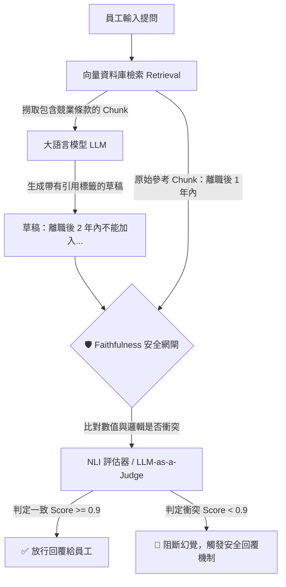

# Unit 5 課後實務演練 (範例解答)
## 題目二：RAG 引用追溯與 Faithfulness 驗證流程設計

**應用場景**：企業內部「員工法規合規問答機器人」
**核心觀念**：在 RAG (Retrieval-Augmented Generation) 架構中，最危險的並非「找不到資料」，而是模型基於找到的資料「自創或扭曲了事實」（也就是幻覺）。透過建立獨立的 **Faithfulness (事實一致性) 安全網閘**，我們能防堵模型給出錯誤的合規或法務建議。

---

### 第一部分：事實一致性比對的安全流程設計

當員工輸入：*「我想查一下公司關於競業禁止條款的規定，離職後多久內不能去競爭對手那裡？」* 時，系統的防禦流程如下：



**流程文字描述：**
1.  **檢索 (Retrieval)**：系統將員工提問轉為向量，從人資規章 PDF 向量庫中找出最相關的段落 (Chunk)，原文寫著：「依據勞基法與本公司規章，員工離職後 **1 年內**不得從事相關競爭行為。」
2.  **草稿生成 (Draft Generation)**：系統的生成模型 (Generator) 讀取了上述 Chunk，但因為模型本身的幻覺或預訓練語料的干擾，產生了錯誤的草稿：「根據公司規定，您在離職後 **2 年內**不能加入競爭對手 [引用來源1]。」
3.  **網閘比對 (Faithfulness Evaluation)**：在回覆給員工前，獨立的「評估模組」會將「生成的草稿」與「原始 Chunk」進行事實比對。

---

### 第二部分：網閘阻斷機制與安全回覆偽代碼 (Pseudocode)

**阻斷情境分析**：
評估模組 (可以是另一個專門檢查邏輯的 LLM，或是 NLI 模型) 敏銳地抓到了草稿中的「2 年」與原文中的「1 年」存在**嚴重事實衝突**。此時 Faithfulness 分數會被判定為不及格，網閘必須強行攔截這個錯誤的生成結果，不讓員工看到錯誤數字，以免造成勞資糾紛。

**安全回覆設計原則**：
當網閘觸發時，系統不應該直接報錯當機，而是採用**「退回原文展示 (Fallback to Source)」**的策略，直接把檢索到的正確條文丟給員工自己看。

**系統偽代碼 (Python 概念實作)：**

```python
def generate_hr_response(user_query):
    # 1. 檢索出最相關的規章段落
    retrieved_chunks = vector_database.search(user_query, top_k=1)
    source_text = retrieved_chunks[0].text  # 例如: "...離職後 1 年內不得..."
    
    # 2. 呼叫生成模型，產生初步解答 (可能包含幻覺)
    draft_response = llm.generate(prompt=build_prompt(user_query, retrieved_chunks))
    # draft_response 可能變成: "...離職後 2 年內..."
    
    # 3. 🛡️ 啟動 Faithfulness 安全網閘進行比對
    # 檢查草稿內容是否完全忠於來源文本
    faithfulness_score = evaluator.check_consistency(
        claim=draft_response, 
        context=source_text
    )
    
    # 4. 根據安全分數決定回覆策略
    if faithfulness_score < 0.9:
        # 🛑 阻斷幻覺：記錄日誌，並返回安全備案
        log_hallucination_event(user_query, draft_response, source_text)
        
        safe_reply = (
            "⚠️ **【系統安全攔截】**\n"
            "系統發現 AI 自動產生的解答可能與公司規章原文有所出入。\n"
            "為保障您的權益並避免法規誤解，請直接閱讀以下擷取的原始規章條文：\n\n"
            f"📄 **《員工合規手冊》節錄**：\n> {source_text}"
        )
        return safe_reply
        
    else:
        # ✅ 放行：解答忠於原文
        return draft_response
```

> **💡 實務洞察 (Business Insight)：**
> RAG 系統的最高境界不僅僅是「搜尋+生成」，而是具備「自我糾錯與阻斷」的能力。對於合規、法律、醫療等容錯率極低的領域，建立一套嚴格的 Faithfulness 驗證流程，是 AI 能否真正在企業內部落地上線的最後一哩路。
