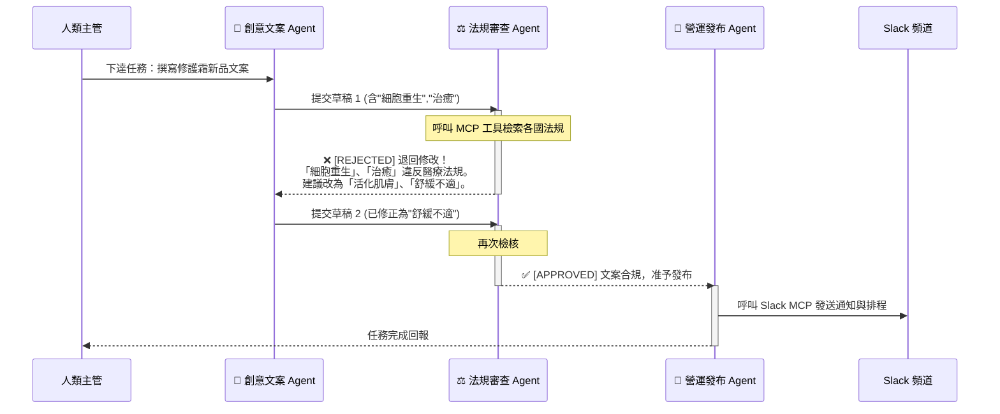

# Unit 6 課後實務演練 (範例解答)
## 題目一：「智慧行銷與法規合規」多代理人協作系統設計

**應用場景**：跨國化妝品品牌「全自動新品社群推廣與各國廣告法規合規審查」系統。
**核心觀念**：多代理人架構 (Multi-Agent System) 的精髓在於**「分權與制衡」**。讓負責發想創意的 LLM 與負責嚴格把關法規的 LLM 相互對抗與協作，能達成人類團隊般的「自主品質迭代 (Autonomous Refinement)」。

---

### 第一部分：三大核心 Agent 角色與工具賦能設計

在該系統中，我們規劃了三個各司其職的 Agent，組成一個具備自我修正能力的閉環團隊：

#### 🎨 Agent 1：創意文案大師 (Marketing Copywriter Agent)
*   **Role (角色定位)**：頂尖的國際美妝社群行銷總監。
*   **System Instructions (系統指令)**：
    「你負責依據新品特徵與目標受眾，產出高轉化率、具備強烈時尚感的社群文案（IG/Facebook）。你的文案必須包含吸引人的鉤子 (Hook)、情感共鳴以及明確的行動呼籲 (CTA)。」
*   **授權 MCP Tools (模型上下文協議工具)**：
    *   `mcp/product_database_search`：檢索新品成分、功效與主打賣點。
    *   `mcp/social_trend_analyzer`：抓取當下美妝圈的熱門 Hashtag 與流行語。

#### ⚖️ Agent 2：法規審查鐵面 (Global Compliance Reviewer Agent)
*   **Role (角色定位)**：嚴格無私的跨國化妝品法規法務長。
*   **System Instructions (系統指令)**：
    「你是無情的合規把關者。請嚴格審查文案中是否出現當地法規（如台灣衛福部、歐盟化妝品法規）禁用的『醫療療效、誇大不實、保證字眼』（如：徹底根除、抗發炎、細胞再生）。若發現違規，請退回並具體列出【違規詞彙】與【修改建議】；若完全合規，請給予 `[APPROVED]` 標記。」
*   **授權 MCP Tools (模型上下文協議工具)**：
    *   `mcp/global_fda_regulations_db`：檢索各國最新的化妝品廣告禁用詞庫與法規條文。

#### 🚀 Agent 3：營運發布總管 (Automation Dispatcher Agent)
*   **Role (角色定位)**：跨國營運與自動化部署專家。
*   **System Instructions (系統指令)**：
    「你只接收帶有 `[APPROVED]` 標記的文案。負責根據指定的發布國家進行在地化微調排版，並將最終定稿發送至企業內部的 Slack 通知群組，並排程至社群平台。」
*   **授權 MCP Tools (模型上下文協議工具)**：
    *   `mcp/slack_webhook_sender`：呼叫企業內部 API，將核准內容發送至跨國行銷部的 Slack 頻道。
    *   `mcp/social_media_scheduler`：串接發文系統，自動排程發布。

---

### 第二部分：閉環自主修正歷程 (Autonomous Refinement Loop)

當 Agent 1 寫了一句「使用七天，讓受損肌膚**細胞重生**，徹底**治癒**敏感紅腫！」時，系統的運作流程如下圖與偽代碼所示：

#### 🔄 系統架構與互動流程圖



#### 💻 核心協作控制偽代碼 (Orchestration Pseudocode)

```python
def multi_agent_workflow(product_brief, target_country):
    max_revisions = 3
    revision_count = 0
    feedback = ""
    
    # 閉環對抗機制 (Loop)
    while revision_count < max_revisions:
        # 1. 創意 Agent 生成或根據回饋修改文案
        draft = copywriter_agent.generate(product_brief, feedback)
        
        # 2. 法規 Agent 進行嚴格審核
        review_result = compliance_agent.evaluate(draft, target_country)
        
        if "[APPROVED]" in review_result:
            # 3. 審查通過，跳出修改迴圈，交給營運 Agent
            print(f"迭代 {revision_count+1} 次後，法規審查通過！")
            dispatcher_agent.publish_to_slack_and_social(draft)
            return "✅ 自動化發布成功"
            
        else:
            # 4. 審查失敗，提取審查意見並要求重寫
            print(f"第 {revision_count+1} 次審查失敗，退回修改中...")
            feedback = review_result  # 將失敗原因餵回給 Agent 1
            revision_count += 1
            
    # 防止無限迴圈的安全機制
    dispatcher_agent.alert_human("⚠️ 達到最大修改次數限制，請人類主管介入人工審查。")
    return "❌ 任務暫停，等待人工介入"
```

> **💡 實務洞察 (Business Insight)：**
> 這種 **Actor-Critic (演員與評論家)** 的多代理人架構，徹底解決了單一 LLM 容易「顧此失彼」（要它有創意，法規就容易出錯；要它嚴謹，文案就變得死板）的痛點。透過分離角色與 MCP 工具，我們能打造出兼顧爆款流量與零合規風險的企業級 AI 行銷自動化產線。
