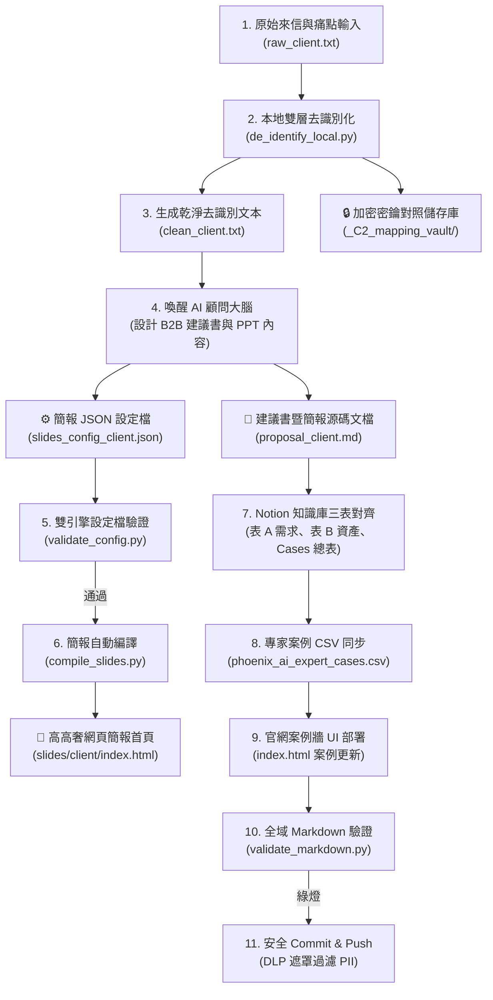

# 🦅 鳳凰 AI ｜ B2B 企業需求對接與簡報/KM 自動化營運手冊 (SOP)
> **Phoenix AI B2B Enterprise Pipeline & Slide/KM Automation Standard Operating Procedure (v2026)**
> 
> 本手冊為「鳳凰 AI 顧問團隊」專屬之標準作業程序，詳細記載在收到「全新企業需求單（或外部來信評價）」時，如何「喚醒與引導 AI 助理（Antigravity）」，並配合本地自動化工具鏈，完美完成「去識別化 ➔ 建議書撰寫 ➔ 簡報自動編譯 ➔ 本地與 Notion 知識庫同步 ➔ GitHub 綠燈發布」的閉環流程。

---

## 🗺️ 鳳凰 AI 全景自動化工作流 (Mermaid)



---

## Ⅰ. 如何「喚醒」AI 助理啟動此流程？

當您收到新的企業需求單時，您只需複製需求信件，並在對話框中發送以下 **「喚醒 Master Prompt」** 給我，我就會自動識別並以「解決方案專家與安全策略長」的雙重身分接管後續的完整任務：

### 💬 喚醒 Master Prompt 範本
> **請複製以下文字並替換大括號中的內容發送給我：**
> 
> ```text
> 鳳凰 AI 團隊，我們收到了來自【客戶產業/公司簡稱，例如：連鎖茶飲加盟集團】的全新企業需求單與外部評量。
> 請為我接管並執行鳳凰 AI 內部 B2B 顧問對接 SOP，流程要求如下：
> 
> 1. 【安全】將以下原始信件存為 scripts/raw_{client_name}.txt，並執行本地雙層去識別化，產生 scripts/clean_{client_name}.txt，將個資、人名與品牌完全進行 C3 等級去識別化遮罩（如替換成 bracketed 標籤），加密對照表寫入儲存庫。
> 2. 【方案】以孟顧問與陳策略長身分，為其量身定制「客製化建議書」與「10 頁高奢 Obsidian 簡報內容」，針對其痛點給出務實、利潤/變革導向的解法，並生成對齊 schema 的 scripts/slides_config_{client_name}.json。
> 3. 【編譯】執行本地雙引擎驗證與編譯器，產出 slides/{client_name}/index.html 簡報。
> 4. 【KM】將去識別化案例卡片寫入課程 CSV 總表，並在 index.html 的標竿案例牆中靜態部署 Case 4 展示卡。
> 5. 【校驗與推送】執行 validate_markdown.py 確保綠燈，執行安全掃描後，正式 Git Commit 並 Push 到 GitHub 倉庫。
> 
> 📥 原始企業需求單內容如下：
> 【在此貼上原始信件全文】
> ```

---

## Ⅱ. 鳳凰 AI 顧問對接五大階段詳細實操 SOP

當您發送喚醒指令後，我會引導您配合以下本地工具鏈進行自動化構建：

### 階段一：安全去識別化（DLP 護欄防禦）
1.  **儲存原始輸入**：
    *   將原始信件內容寫入：`scripts/raw_[client_name].txt`（此檔案已自動列入 Git 忽略，絕不洩漏）。
2.  **執行去識別化**：
    *   本機執行去識別化腳本：
        ```powershell
        $env:PYTHONIOENCODING="utf-8"; python scripts/de_identify_local.py scripts/raw_[client_name].txt
        ```
    *   這會自動生成去識別化後的乾淨文本 `scripts/clean_[client_name].txt`，並在 `_C2_mapping_vault/[client_name]/map.enc` 生成加密對照表。

### 階段二：產出建議書與簡報 JSON
*   AI 助理會根據乾淨的 `clean_[client_name].txt` 進行商務推理，設計 10 頁多元板式（`cover`、`dual-track`、`interactive-roi`、`interactive-roadmap`、`next-steps`）的簡報，並生成：
    1.  `scripts/proposal_[client_name].md`（B2B 客戶建議書，內含 Notion 三表映射屬性）
    2.  `scripts/slides_config_[client_name].json`（對齊 JSON Schema 的簡報設定檔）

### 階段三：本機驗證與簡報自動編譯
1.  **JSON 格式校驗**：
    *   使用雙引擎校驗器，確保簡報欄位字數、金句、ROI 滑塊屬性完全符合 2026 高規格視覺約束：
        ```powershell
        $env:PYTHONIOENCODING="utf-8"; python scripts/validate_config.py scripts/slides_config_[client_name].json
        ```
2.  **一鍵簡報編譯**：
    *   運行簡報編譯器，將 JSON 自動轉換成曜石 Midnight 高奢風格的 HTML 簡報：
        ```powershell
        $env:PYTHONIOENCODING="utf-8"; python scripts/compile_slides.py scripts/slides_config_[client_name].json
        ```
    *   產出路徑：`slides/[client_name]/index.html`（您可點擊滑鼠直接在瀏覽器投影播放）。

### 階段四：本地與 Notion 知識庫同步（KM 沉澱）
1.  **同步離線 CSV 總表**：
    *   在 [phoenix_ai_expert_cases.csv](file:///g:/%E6%88%91%E7%9A%84%E9%9B%B2%E7%AB%AF%E7%A1%AC%E7%A2%9F/AI_Talent/curriculum/unit_7_strategy/phoenix_ai_expert_cases.csv) 的末尾，新增一行去識別化的案例卡片記錄（如 `PHX-CASE-2026-032`），寫入產業、痛點、解法與 ROI 數據。
2.  **官網首頁 UI 展示牆同步**：
    *   打開 [index.html](file:///g:/%E6%88%91%E7%9A%84%E9%9B%B2%E7%AB%AF%E7%A1%AC%E7%A2%9F/AI_Talent/index.html)，將 `cases-grid` 的前三個案例卡片輪替，並將本案的去識別化卡片靜態部署上去，形成官網的獲客 Lead Magnet。
3.  **Notion 線上登錄**：
    *   登入您的 Notion，依據建議書第 5 章規劃的卡片屬性，手動/自動在「案例總表」、「表 A 需求庫」、「表 B 資產庫」中創建卡片並拉起雙向 Relation 關聯。

### 階段五：CI/CD 檢測與 Git 發布
1.  **全域 Markdown 格式校驗**：
    *   在 Git 提交前，於本機執行全域 Markdown 語法、 LaTeX Delimiter 與 Heading 階層檢查，確保不會因格式瑕疵拉垮 GitHub CI 構建：
        ```powershell
        $env:PYTHONIOENCODING="utf-8"; python scripts/validate_markdown.py
        ```
2.  **交付前安全洩漏掃描**：
    *   再次對編譯成品目錄進行洩漏掃描，確保無任何真實個資外流：
        ```powershell
        $env:PYTHONIOENCODING="utf-8"; python scripts/de_identify_local.py scan slides/[client_name]/
        ```
3.  **Git 提交與推送**：
    *   執行 Git 三部曲，安全推送至 GitHub 遠端倉庫：
        ```powershell
        git add .
        git commit -m "feat(unit7): integrate de-identified case study and update landing page showcase for [client_name]"
        git push origin main
        ```

---

## 💡 顧問日常維運技巧與小撇步

*   **遇 CP950 Windows 編碼崩潰**：
    *   在 Windows 終端機運行任何 Python 腳本前，務必加上 `$env:PYTHONIOENCODING="utf-8"` 前綴，這能完美阻斷中文或特殊 Unicode 字元（如 `✓`、`✅`）引發的編碼崩潰。
*   **字數限制警戒線**：
    *   在執行 `validate_config.py` 時，建議加上 `--max-chars 200` 進行極限排版字數測試。因為 `dual-track` 投影片的左右欄位，若字數大於 200 字，在 iPad 等行動裝置上可能會造成文字溢出遮擋，精確的字數管理是維持簡報高奢感的隱形關鍵！
